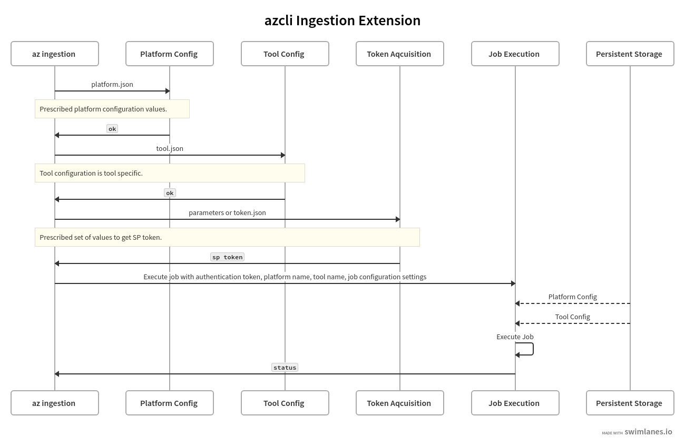

# azure-cli-extensions


Example dxtensions repository, see the other repo [azure-cli-extension](https://github.com/grecoe/azure-cli-extension) for more details on how this is used.


The example extension here extends the Azure CLI with the following command:

> az energy ....

This batch of commands mimic the required settings to launch an ingestion process to an OSDU platform. 

An ingestion job requires a significant amount of information:

1. An authentication token that is permitted to perform actions on the OSDU instance.
2. The configuration information about the OSDU platform, including platform URL, data partition, and endpoint URL's in which to perform tasks on. 
3. Specific tool configuration information, such as what would be needed to execute an sdutils job. 
4. Job configuration information about what data is to be moved with the chosen tool. 

This information is too bulky to be passed along with a single command line hence the extension stores platform and tool configuration information (never job or authentication information) to the local drive under the folder:

> /platform_user_path/.azext_energy

<b>Contents</b>
- [Repository Layout](#repository-layout)
- [Command Flow](#command-flow)
- [Commands](#commands)


## Repository Layout

What is used in this repo (code under src/energy/azext_energy)

|Location|File|Interest|
|---|----|----|
|.|__ init __.py|Prepares the commands to be called by the cli engine.|
|.|custom.py|Imports calls to expose under generated/|
|./generated|_params.py|Set up parameters and a parameter validation for the calls.|
|./generated|_validators.py|Implements the parameter validators used in _params.py|
|./generated|_help.py|The help shown when requested by the user.|
|./generated|_client_factory.py|Clients that can be dynamically passed to calls.|
|./generated|commands.py|Creates a sub group of calls|
|./generated|custom.py|Contains the actual action call to get a token.|


Might come in handy, [management client](https://github.com/Azure/azure-cli-extensions/blob/main/src/aks-preview/azext_aks_preview/_client_factory.py)

## Command Flow


## Commands

- az energy 
```bash
Group
    az energy : Commands to manage Energy Platform.
Subgroups:
    auth
    execute
    platform
    utility
```

- az energy auth
```bash
Group
    az energy auth
Commands:
    platform : Get authentication token from existing platform refresh token.
    sp       : Get authentication token for service principal.
    user     : Get authentication token for current user.
```

- az energy platform
```bash
Group
    az energy platform
Commands:
    add    : Adds an OSDU platform configuration to cli settings.
    list
    remove
    show
```

- az energy utility
```bash
Group
    az energy utility
Commands:
    add    : Adds a utility configuration to the settings.
    list
    remove
    show
```

- az energy execute
```bash
Group
    az energy execute
Commands:
    job
```
